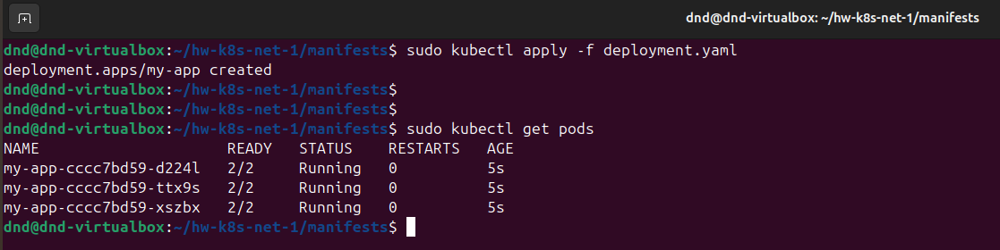
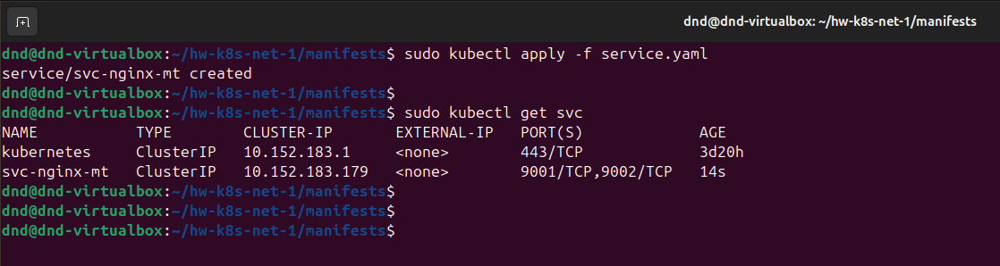
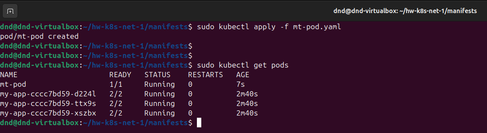
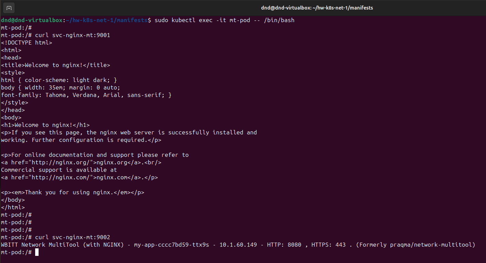
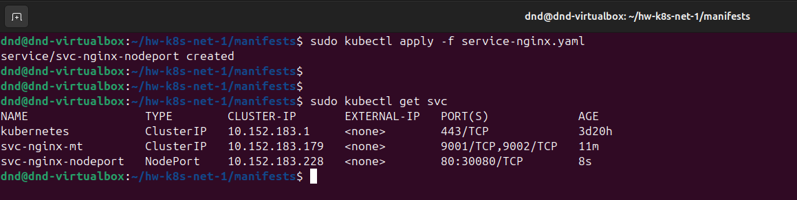
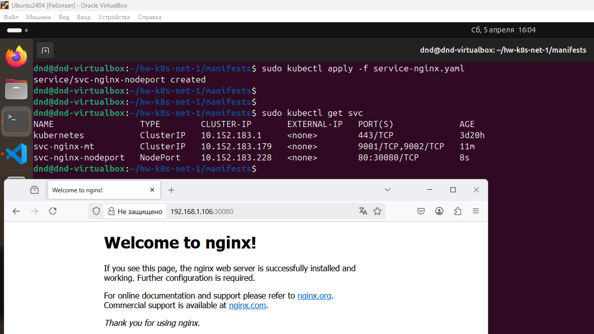

# Домашнее задание к занятию "`Сетевое взаимодействие в K8S. Часть 1`" - `Дедюрин Денис`

---
## Задание 1. Создать Deployment и обеспечить доступ к контейнерам приложения по разным портам из другого Pod внутри кластера

1. Создать Deployment приложения, состоящего из двух контейнеров (nginx и multitool), с количеством реплик 3 шт.
2. Создать Service, который обеспечит доступ внутри кластера до контейнеров приложения из п.1 по порту 9001 — nginx 80, по 9002 — multitool 8080.
3. Создать отдельный Pod с приложением multitool и убедиться с помощью `curl`, что из пода есть доступ до приложения из п.1 по разным портам в разные контейнеры.
4. Продемонстрировать доступ с помощью `curl` по доменному имени сервиса.
5. Предоставить манифесты Deployment и Service в решении, а также скриншоты или вывод команды п.4.

### Ответ:

1. Создаем манифест для приложений и 3х реплик для них:

```
apiVersion: apps/v1
kind: Deployment
metadata:
  name: my-app
spec:
  replicas: 3
  selector:
    matchLabels:
      app: my-app
  template:
    metadata:
      labels:
        app: my-app
    spec:
      containers:
      - name: nginx
        image: nginx:1.21
        ports:
        - containerPort: 80
      - name: multitool
        image: wbitt/network-multitool
        env:
          - name: HTTP_PORT
            value: "8080"
        ports:
        - containerPort: 8080
        name: http-port
```

```
sudo kubectl apply -f deployment.yaml
```

```
sudo kubectl get pods
```



2. Создаем манифест сервиса **service.yaml**, который обеспечит доступ внутри кластера до контейнеров приложений:

```
apiVersion: v1
kind: Service
metadata:
  name: svc-nginx-mt
spec:
  ports:
    - name: nginx
      port: 9001
      targetPort: 80
    - name: multitool
      port: 9002
      targetPort: 8080
  selector:
    app: my-app
```

```
sudo kubectl apply -f service.yaml
```

```
sudo kubectl get svc
```



3. Создаем отдельный Pod **mt-pod.yaml** с приложением multitool, запускаем и проверяем:

```
apiVersion: v1
kind: Pod
metadata:
  name: multitool-test
spec:
  containers:
  - name: multitool
    image: wbitt/network-multitool
    command: ["sleep", "3600"]
```
    
```
sudo kubectl apply -f mt-pod.yaml
```

```
sudo kubectl get pods
```



Проверяем, что из пода есть доступ до приложений:

```
sudo kubectl exec -it mt-pod -- /bin/bash
```

```
curl svc-nginx-mt:9001
```

```
curl svc-nginx-mt:9002
```



---
## Задание 2. Создать Service и обеспечить доступ к приложениям снаружи кластера

1. Создать отдельный Service приложения из **Задания 1** с возможностью доступа снаружи кластера к nginx, используя тип NodePort.
2. Продемонстрировать доступ с помощью браузера или `curl` с локального компьютера.
3. Предоставить манифест и Service в решении, а также скриншоты или вывод команды п.2.

### Ответ:

1. Создаем отдельный манифест сервиса **service-nginx.yaml**, который обеспечит доступ снаружи кластера к **nginx**:

```
apiVersion: v1
kind: Service
metadata:
  name: svc-nginx-nodeport
spec:
  type: NodePort
  selector:
    app: my-app
  ports:
    - name: nginx
      protocol: TCP
      port: 80
      targetPort: 80
      nodePort: 30080
```

```
sudo kubectl apply -f service-nginx.yaml
```

```
sudo kubectl get svc
```



2. Проверяем доступ к сервису с локальной машины:

